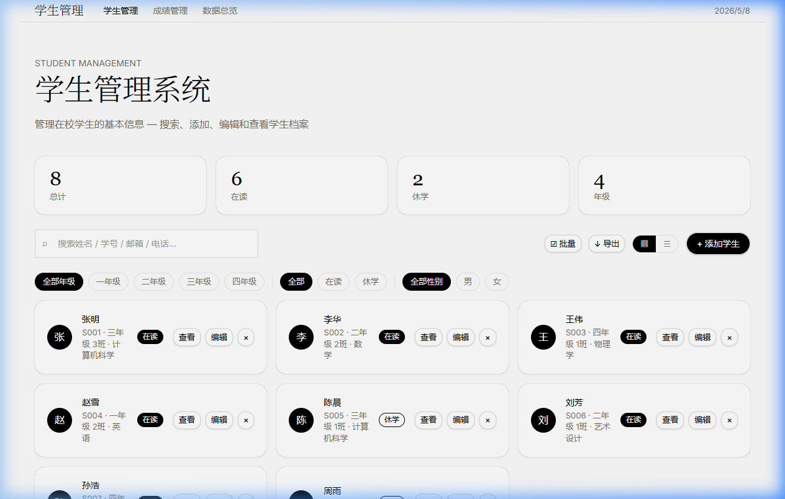
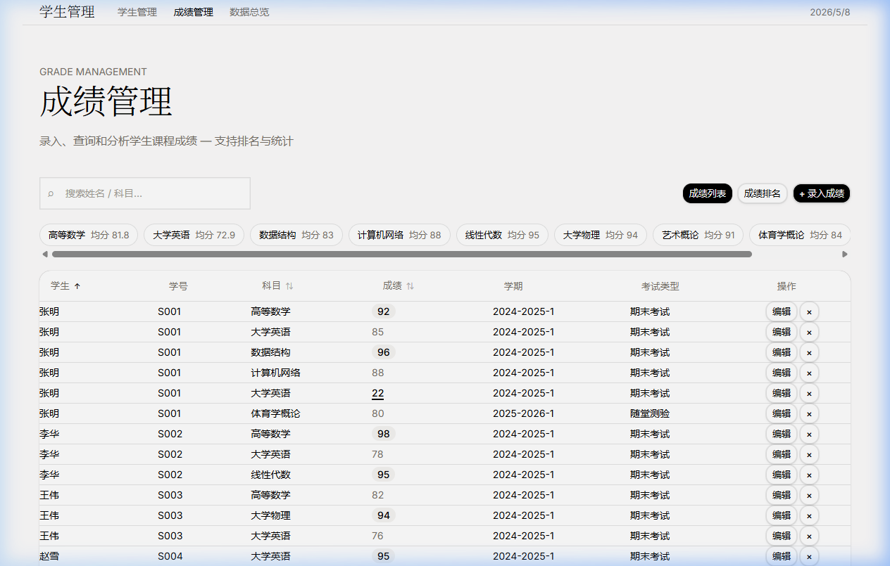
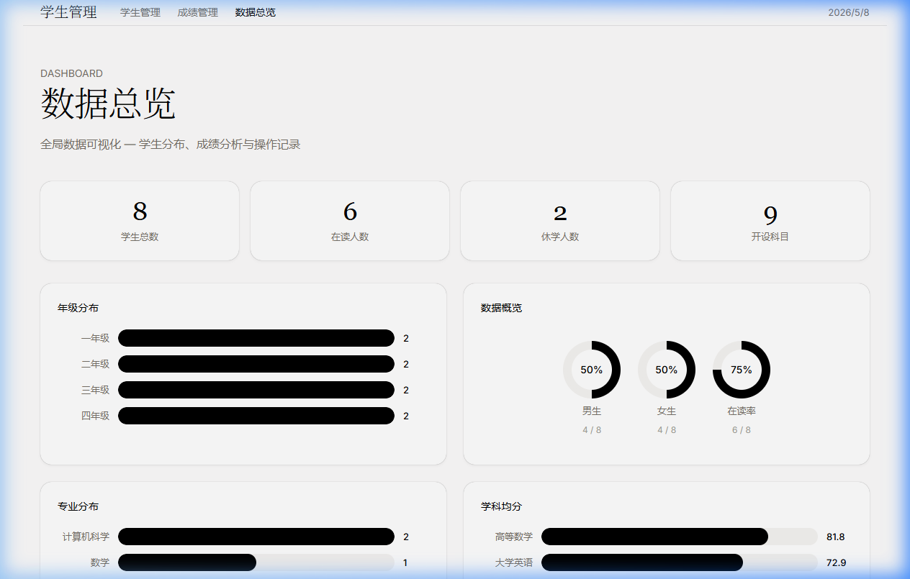

# 学生管理系统

> 基于 ElevenLabs 设计语言构建的纯前端学生管理系统，包含成绩管理与数据可视化功能。

### 📱 界面预览

| 学生管理 | 成绩管理 | 数据总览 |
| :---: | :---: | :---: |
|  |  |  |

## ✨ 功能特性

| 功能 | 说明 |
|------|------|
| 📋 **学生管理** | 支持卡片网格 / 表格视图切换，支持批量操作 |
| 🎓 **成绩管理** | 课程成绩录入、编辑、删除，支持按成绩排名 |
| 📊 **数据总览** | 实时统计年级分布、专业分布、性别比例等可视化图表 |
| 🔍 **搜索筛选** | 按姓名、学号、邮箱搜索，支持按年级、状态、性别多重筛选 |
| 🏷️ **批量操作** | 支持批量删除学生、批量修改在读/休学状态 |
| 💾 **数据导出** | 支持导出 CSV 文件及 JSON 备份，支持 JSON 数据导入 |
| 📈 **统计分析** | 自动计算各科平均分、总分及排名 |
| 💾 **数据持久化** | 浏览器 localStorage 存储，确保数据不丢失 |
| 📱 **响应式设计** | 适配桌面端和移动端，极致的视觉体验 |

## 🎨 设计语言

严格遵循 **ElevenLabs** 设计规范：

- **底色** `#fdfcfc` (Eggshell) — 微暖近白，非纯白
- **字体** — Waldenburg 300 轻量衬线标题 + Inter 400/500 正文
- **色彩** — 近零饱和度，`#000` 主文字，`#777169` 次文字
- **按钮** — 黑色实心药丸 + 白色幽灵药丸，`9999px` 圆角
- **卡片** — 白色 `#ffffff` 背景，`16px` 圆角，极薄阴影
- **输入框** — `0px` 圆角，编辑式风格
- **布局** — 最大宽度 `1200px` 居中，区块间距 `80-120px`

详见 [ElevenLabsDESIGN.md](./ElevenLabsDESIGN.md) 完整设计文档。

## 📁 项目结构


```
├── index.html              # 入口 HTML
├── ElevenLabsDESIGN.md     # ElevenLabs 设计文档
├── css/
│   ├── tokens.css          # 设计 Token
│   ├── base.css            # 全局重置
│   ├── components.css      # 基础 UI 组件
│   ├── components-new.css  # 新增功能组件样式
│   └── layout.css          # 布局样式
├── js/
│   ├── store.js            # 数据持久化与逻辑层
│   ├── components.js       # UI 组件渲染
│   ├── app-core.js         # 学生管理主逻辑
│   ├── app-grades.js       # 成绩管理逻辑
│   └── app-dashboard.js    # 数据总览逻辑
└── plan/                   # 实现计划文档
```

## 🛠️ 技术栈

- **HTML5** — 语义化标签
- **CSS3** — Custom Properties (设计 Token 系统)
- **Vanilla JavaScript (ES6+)** — 模块化开发
- **localStorage** — 浏览器端数据持久化

无任何第三方依赖。

## 📝 使用说明

1. **多页面切换** — 通过顶部导航栏在「学生管理」、「成绩管理」和「数据总览」间切换
2. **批量操作** — 在学生管理页点击「☑ 批量」开启，可批量删除或修改状态
3. **数据备份** — 点击「↓ 导出」可导出 CSV 报表或 JSON 备份，也可导入之前的备份
4. **成绩录入** — 在成绩管理页点击「+ 录入成绩」为指定学生添加单科分数
5. **视图切换** — 点击 ▦/☰ 图标切换卡片/表格模式